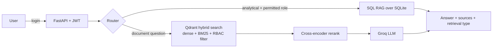

# MediBot — Advanced RAG with Retrieval-Layer RBAC

A secure internal healthcare assistant built with **Hybrid RAG** (dense + BM25), **cross-encoder reranking**,
**SQL RAG**, and **role-based access control enforced inside Qdrant**, not just in the UI.

> 🚧 **Work in progress.** Built step by step as a learning project. Progress is tracked in [docs/ROADMAP.md](docs/ROADMAP.md).

## The problem
MediAssist Health Network (12 hospitals, 40+ clinics) keeps its clinical protocols, drug formularies, billing guides and
equipment manuals in hundreds of PDFs. Staff can't find answers, and there are no access controls: a ward nurse can reach
billing and procurement data.

## What MediBot does
- **Structure-aware ingestion**: Docling parses headings and tables; HybridChunker splits by section first, then by token count.
  Each chunk keeps its heading context.
- **Hybrid retrieval**: dense (semantic) and BM25 (exact terms like drug names and ICD codes) searched in one Qdrant query
  and fused with RRF.
- **Reranking**: a cross-encoder narrows the top-10 candidates to the top-3 before the LLM sees them.
- **SQL RAG**: analytical questions ("how many claims were escalated last month?") are answered from SQLite.
- **RBAC at the retrieval layer**: every vector query carries an `access_roles` filter. The LLM never sees restricted chunks,
  so a prompt injection has nothing to leak.

## Architecture

Details: [docs/ARCHITECTURE.md](docs/ARCHITECTURE.md)

## Roles

| Role | Collections |
|---|---|
| doctor | clinical, nursing, general |
| nurse | nursing, general |
| billing_executive | billing, general (+ SQL RAG) |
| technician | equipment, general |
| admin | all (+ SQL RAG) |

## Tech stack
Docling · FastEmbed (bge-small + BM25) · Qdrant · sentence-transformers cross-encoder · Groq · SQLite · FastAPI · Next.js

## Documentation
| Doc | Contents |
|---|---|
| [docs/REQUIREMENTS.md](docs/REQUIREMENTS.md) | Full requirements, traced to IDs R1–R8 |
| [docs/ARCHITECTURE.md](docs/ARCHITECTURE.md) | Components, data flow, security model |
| [docs/DECISIONS.md](docs/DECISIONS.md) | What we chose and why (including tool substitutions) |
| [docs/ROADMAP.md](docs/ROADMAP.md) | Day-by-day plan and session log |

## Setup
_Coming on Day 1._

## Adversarial RBAC tests
_Coming on Day 9._

## License
MIT
