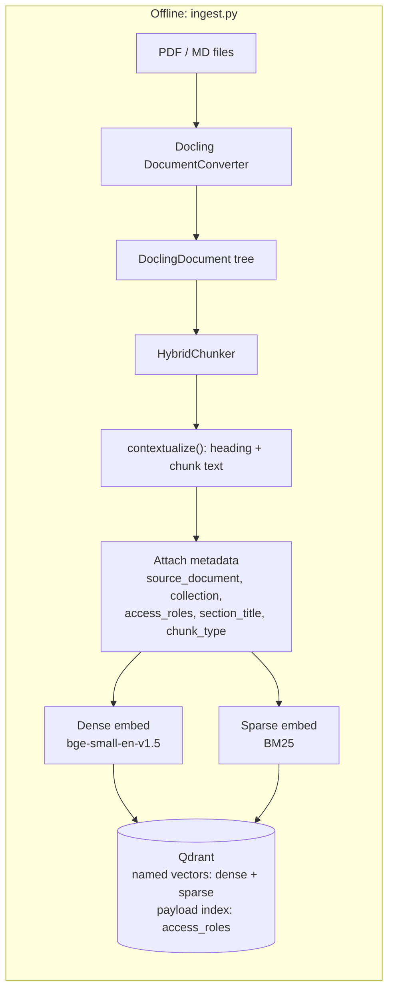
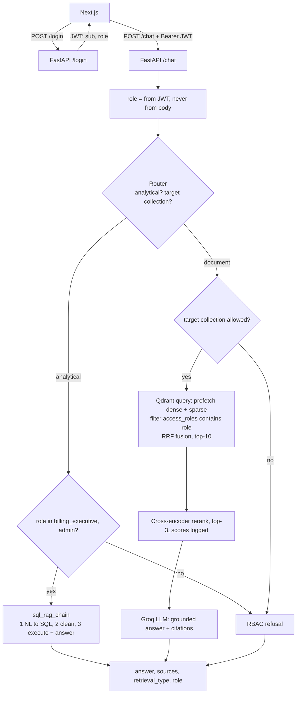

# MediBot — Architecture

## 1. Big picture

Two separate pipelines:

- **Offline ingestion**, run once with `scripts/ingest.py`: documents → structured chunks → dense + sparse vectors → Qdrant.
- **Online query**: the API that handles login and chat requests.

They are kept apart because Docling and the embedding models are slow to load. The API should start quickly and only ever read from the index.





## 2. Components

### 2.1 Ingestion (`backend/app/ingestion/`)
| Step | Tool | Why |
|---|---|---|
| Parse | Docling `DocumentConverter` | Layout and table models find headings, tables and reading order. Plain text extraction flattens tables, so a dosage table ends up as a list of unrelated numbers. |
| Chunk | Docling `HybridChunker` | Splits by structure first, then by token count. Uses the **same tokenizer as the embedding model**, so no chunk is silently cut off at embed time. |
| Contextualise | `chunker.contextualize(chunk)` | Adds the heading path to the chunk text. "25 mg twice daily" becomes "Drug Formulary > Metformin > Dosage: 25 mg twice daily". |
| Metadata | our code | `collection` comes from the folder name, `access_roles` from one RBAC map, `section_title` from `chunk.meta.headings`, and `chunk_type` from Docling item labels (table/code/text). |

CPU note: the PDFs are digital (not scanned), so we can **turn off OCR** in Docling. This speeds up parsing a lot on CPU.

### 2.2 Vector store (Qdrant in Docker)
- One Qdrant collection, `medibot_docs`, with **named vectors**:
  - `dense`: 384-dim, cosine (bge-small-en-v1.5)
  - `sparse`: BM25 via FastEmbed `Qdrant/bm25`, with the `IDF` modifier so Qdrant computes IDF itself
- **Payload index** on `access_roles` (keyword) and `collection`, so filtering is fast and happens inside the search.
- Why one collection instead of five: RBAC then comes from a *metadata filter*, which is what the brief asks for. It also lets admin search across everything in one query.

### 2.3 Hybrid retrieval (`backend/app/retrieval/`), using qdrant-client directly
One `query_points` call:
```
prefetch = [ dense search (limit 20, filter), sparse search (limit 20, filter) ]
query    = FusionQuery(RRF)
filter   = access_roles MatchAny([role])
limit    = 10
```
- **Why RRF** (Reciprocal Rank Fusion): dense (cosine) and BM25 scores are on different scales, so adding them doesn't mean anything. RRF only uses rank positions.
- **Why write it with qdrant-client instead of LangChain**: the filter placement is visible and easy to audit, and it's a learning goal.

### 2.4 Reranker
- `cross-encoder/ms-marco-MiniLM-L-6-v2` (default: small and fast on CPU). `BAAI/bge-reranker-base` can be compared in the eval.
- A bi-encoder embeds the query and the chunk *separately*. A cross-encoder reads them *together*, so it's more accurate but too slow to run over the whole index. That's why we use it only on the top 10 to get the top 3.

### 2.5 SQL RAG (`backend/app/sql_rag/`)
`sql_rag_chain(question) -> str`:
1. **Generate**: the LLM gets the schema (and a few sample rows) and writes a SQLite SELECT.
2. **Clean**: strip code fences, `SQLQuery:` prefixes and extra prose; keep one statement; reject anything that isn't SELECT or WITH.
3. **Execute and answer**: run it on a **read-only** connection (`file:mediassist.db?mode=ro`) with a row limit, then the LLM phrases the result.

### 2.6 Router (`backend/app/routing/`)
The LLM returns JSON: `{"type": "analytical" | "document", "target_collections": [...]}`.
- `type` picks SQL RAG or Hybrid RAG.
- `target_collections` is only used to **write a clear refusal message** ("you do not have access to billing documents"). **It is not the security boundary.** Even if the router is fooled, the Qdrant filter still blocks the data.
- If the LLM output can't be parsed, a keyword heuristic is used instead.

### 2.7 API & auth (`backend/app/api/`)
- FastAPI, with demo users in a config file (bcrypt-hashed passwords) and a JWT holding `sub` and `role`.
- `/chat` reads the role from the token through a dependency. If the request body includes a role, it is ignored or checked against the token's role.

### 2.8 Frontend (`frontend/`)
Next.js (App Router): a login page and a chat page with a role badge, a sidebar listing accessible collections, citation chips, a retrieval-type label and a styled refusal message.

## 3. Security model: defence in depth

| Layer | What it stops | Is it the security boundary? |
|---|---|---|
| JWT role, set on the server | Client claiming a higher role | ✅ |
| **Qdrant `access_roles` filter** | Restricted chunks ever being retrieved | ✅ **the main one** |
| Router refusal | Pointless retrieval and a confusing answer | ❌ (only for a better message) |
| System prompt ("answer only from context") | Hallucination | ❌ |
| SQL read-only + SELECT allowlist | Destructive or injected SQL | ✅ |

The principle: **the LLM can't leak what it never saw.** Prompt injection can change what the model *says*, but it can't change which chunks Qdrant *returns*.

## 4. Tech stack

| Concern | Choice |
|---|---|
| Language | Python 3.11+, TypeScript |
| Parsing / chunking | Docling + HybridChunker |
| Dense embeddings | `BAAI/bge-small-en-v1.5` via FastEmbed (ONNX, CPU friendly) |
| Sparse embeddings | FastEmbed `Qdrant/bm25` |
| Vector DB | Qdrant (Docker), `qdrant-client` |
| Reranker | `cross-encoder/ms-marco-MiniLM-L-6-v2` (sentence-transformers) |
| LLM | Groq API (Llama 3.x 70B class) |
| SQL | SQLite (`mediassist.db`) |
| Backend | FastAPI, Pydantic, PyJWT |
| Frontend | Next.js |
| Tests | pytest |

## 5. Planned repo layout

```
medibot-advanced-rag/
├── CLAUDE.md                 # context for Claude Code sessions
├── README.md
├── docs/                     # requirements, architecture, roadmap, decisions
├── docker-compose.yml        # Qdrant
├── backend/
│   ├── app/
│   │   ├── config.py         # settings from .env
│   │   ├── rbac.py           # single source of truth: role → collections
│   │   ├── ingestion/        # docling parse, chunk, metadata
│   │   ├── retrieval/        # qdrant hybrid search, reranker
│   │   ├── sql_rag/          # sql_rag_chain
│   │   ├── routing/          # analytical vs document, target collection
│   │   ├── generation/       # prompts, LLM client, citations
│   │   └── api/              # FastAPI app, auth, endpoints
│   ├── scripts/ingest.py
│   ├── eval/                 # questions.json, compare.py
│   └── tests/                # RBAC adversarial tests, unit tests
├── frontend/                 # Next.js
└── data/                     # dataset (gitignored), see README for how to get it
```
