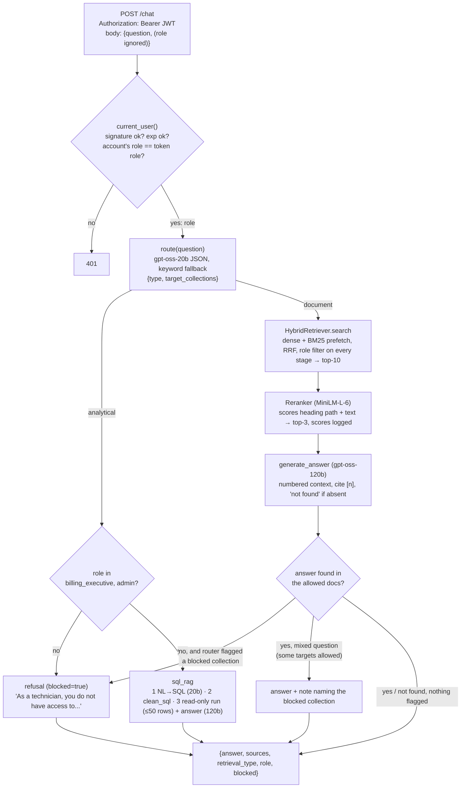

# `/chat` request flow (Days 6–8)

The router decides the *path* and the *wording of a refusal*. It never decides *access*, and since D30 it never
skips the search either (a wrong guess used to hide allowed answers): if it's fooled into
calling a billing question "general", the Qdrant filter still only returns the role's collections
(`tests/test_service.py::test_fooled_router_still_cannot_leak_documents`), and SQL access is checked from the
token's role, not from the router.
