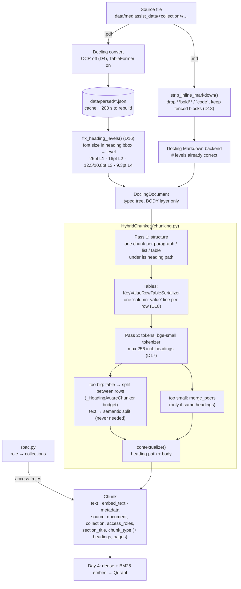
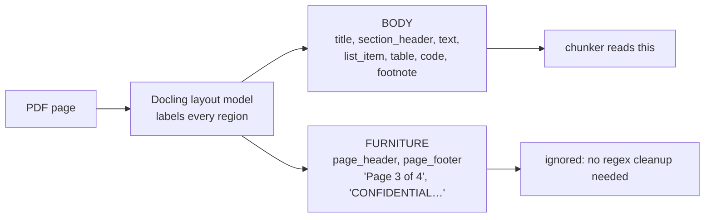

# Ingestion pipeline: diagrams

Built on Day 2 (parsing) and Day 3 (chunking + metadata). Code: `backend/src/medibot/ingestion/`,
`backend/src/medibot/rbac.py`. Decisions: D4, D16, D17, D18 in [DECISIONS.md](../DECISIONS.md).

## 1. From source file to chunk



Result on the dataset: 268 chunks (194 text, 73 table, 1 code), all ≤ 256 tokens, 0 missing metadata.

## 2. Content layers: why headers and footers never reach a chunk (Day 2)



## 3. The heading stack: why heading levels matter (Day 3)

The chunker keeps one heading per level. A heading at level L removes every entry at level ≥ L,
then takes its place. Each chunk gets the headings on the stack when it's emitted.

```
leave_policy.pdf, walking the document top to bottom:

                               BEFORE fix (all L1)          AFTER fix (font size)
  "Leave & Attendance Policy"  [Leave…]                     L1 [Leave…]
  "10. Abandonment of Service" [10. Abandonment…]           L2 [Leave…, 10. Abandonment…]
  "Important" (callout, 9.3pt) [Important]  ← replaced it!  L4 [Leave…, 10. Abandonment…, Important]
  "Absence from duty…" (text)  chunk headings: Important    chunk headings: Leave… > 10. Abandonment… > Important
```

With flat levels the paragraph was embedded under "Important" only; now it carries its real section.

## 4. Splitting a big table: three formats measured (Day 3, D18)

```
drug_formulary "1. Antimicrobials" (16 rows × 7 cols), bge-small tokens

A. Triplets (Docling default)  whole table on ONE line → can only be cut mid-line
   …Piperacillin-Tazobactam, Storage =  ║  Refrigerate post-recon.. Piperacillin-Tazobactam, Notes = …
                               chunk 1 ends here ║ chunk 2 starts here   ✗ fact split in two

B. Markdown + repeat header    splits between rows ✓, but every piece repeats
   | Drug | Class | … |
   |------|-------|---| ← 142 tokens of dashes per piece, only 1–2 rows fit   ✗

C. key: value rows (chosen)    one row per line, ~44 tokens, split between rows ✓
   Approved Drug Formulary
   1. Antimicrobials
   Drug: Amoxicillin; Class: Penicillin; Route: Oral; Standard Dose: 500 mg TDS; …
   Drug: Piperacillin-Tazobactam; …; Storage: Refrigerate post-recon.; …      ✓ every row stands alone
```
